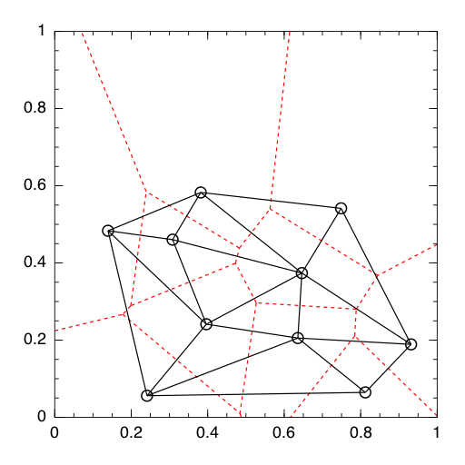
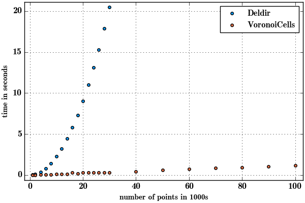

# Deldir

[](https://travis-ci.org/robertdj/Deldir.jl)

[deldir](https://cran.r-project.org/web/packages/deldir) is an R package for computing Delaunay triangulations and Voronoi/Dirichlet tesselations.
This Julia package wraps the Fortran code from deldir.


## Usage

The coordinates of the generators are specified as two vectors that are fed to `deldir`, the main function of this package:

```julia
x = rand(8)
y = rand(8)
D = deldir(x, y)
```

The output from `deldir` is a struct with three DataFrames, one for the topology of the Delaunay triangulation, one for topology of the Voronoi tesselation and a summary mainly related to the area of the triangles and Voronoi cells.

By default, `deldir` works with points in the unit rectangle, but other bounding rectangles can be specified as a third argument.

The area of the Voronoi cells are also available directly with the function `voronoiarea`.

Two functions are available to extract the edges of the Delaunay triangles and Voronoi cells in a "plot friendly" manner:

```julia
Dx, Dy = delaunayedges(D)
Vx, Vy = voronoiedges(D)
```

Using the results from above this can be plotted using e.g. the [Plots package](https://github.com/tbreloff/Plots.jl):

```julia
using Plots
scatter(x, y, xlim=(0,1), ylim=(0,1), markersize=6, label="generators")
plot!(Dx, Dy, label="Delaunay")
plot!(Vx, Vy, style=:dash, label="Voronoi")
```

One realization looks like the following.




## Installation

Install the package by running

```julia
Pkg.add("Deldir")
```

As mentioned, this package is a wrapper for a Fortran library and if the Fortran code is not compiled automatically, you must run the `build.jl` script in the `deps` folder.

Compilation is performed with `gfortran` and I have only tested this on OS X Yosemite and Linux Mint.


## Motivation

This is not the only Julia package for Delaunay/Voronoi computations.
I am aware of the pure Julia implementation [VoronoiDelaunay](https://github.com/JuliaGeometry/VoronoiDelaunay.jl) and the Boost wrapper [Voronoi](https://github.com/Voxel8/Voronoi.jl).

However, Deldir has two qualities that I value:

- It interacts well with the bounding box.
- It returns the area of the Voronoi cells *in the same order as the input generators*.


**Update 2016-05-05**: 
I have made the pure Julia package [VoronoiCells](https://github.com/JuliaGeometry/VoronoiCells.jl) with similar functionalities that executes *much* faster.
Consider the time taken to run the `voronoiarea` functions of both packages with an increasing number of points:



The script generating this output is available in the `examples` folder.
The comparison plot is made with

```julia
julia> versioninfo()
Julia Version 0.5.0
Commit 3c9d753 (2016-09-19 18:14 UTC)
Platform Info:
  System: Linux (x86_64-linux-gnu)
  CPU: Intel(R) Core(TM) i7-3720QM CPU @ 2.60GHz
  WORD_SIZE: 64
  BLAS: libopenblas (USE64BITINT DYNAMIC_ARCH NO_AFFINITY Sandybridge)
  LAPACK: libopenblas64_
  LIBM: libopenlibm
  LLVM: libLLVM-3.7.1 (ORCJIT, ivybridge)
```


## Limitations

Not all features of the R package are available.
I have e.g. chosen to ignore options regarding dummy points. 

Are you missing anything important? 
Check out the [manual](https://cran.r-project.org/web/packages/deldir/deldir.pdf) for the R package to see if the Fortran library supports it.


## Acknowledgement

[Rolf Turner](https://www.stat.auckland.ac.nz/~rolf) is author of the deldir package for R as well as all Fortran code in this package.


## License

The *Julia code* in this package is MIT licensed and the *Fortran code* is licensed under GPL.

